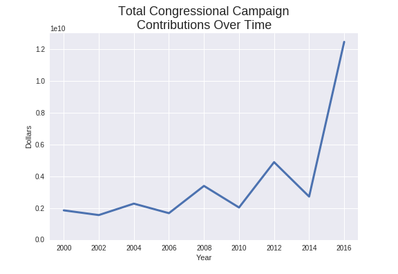
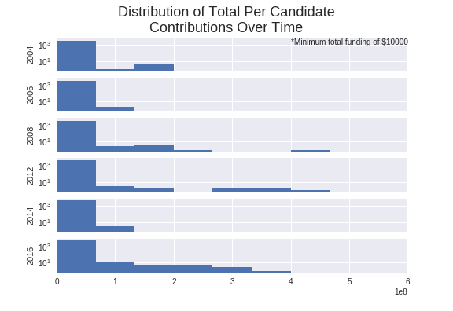
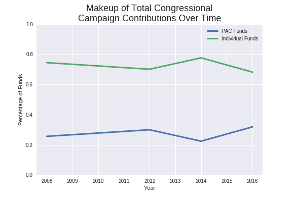

## Quantifying Corruption
### Question 1: Did the Supreme Court case 'Citizens United v. FEC' impact the general nature of campaign contributions?  
The various factors that influence campaign contributions are many as they are varied; is a candidate particularly divisive? Is a campaign's fund-raising capabilities above average? Are potential donors currently experiencing economic prosperity and therefore more likely to have surplus discretionary income? There are also many paradigms through which to view political donations--one broad dichotomy is to consider them either as an investment activity (when the donor believes their donation has a positive expected value for them and weighs this against their opportunity cost), or as a consumptive activity (when the donor believes their donation will further certain values or ideals that are personally agreeable, without thought of future payoff) (Ansolabehere 2003).  

These varied factors make it difficult to approach the question of whether or not 'Citizens United v FEC' had any effect in absolute terms. Certain elements could be controlled for, but many would be difficult to find relevant data on (i.e. how divise was a candidate?). However, we can approach the question of "Did the ruling of 'Citizens United v FEC' achieve what it wanted to achieve?". This requires at least a moderate understanding of the case's content, and the specifics of the ruling itself.  

I am not a legal scholar, but my working high level framework is as follows:
> 'Citizens United v FEC' addressed a potential imbalance in campaign finance, and fundamentally posited that there was too much money flowing into the hands of candidates via Political Action Committees (PACs). This case established the basis for Super Political Action Committees (Super PACs) with the belief that there was currently money going to PACs that more justly should flow to Super PACs. Therefore, if PACs continued to play as important a role as they had prior, 'Citizens United v FEC' couldn't've had the effect it intended.

#### Did the overall amount of money flowing to federal congressional campaigns change from before CUvFEC to after it?  
Todo:  
+ Sum all contributions year before and after  

+ Find average contributions per candidate, compare distributions  

#### Did the makeup of contributions (individuals vs PACs) change in this time frame?  
Todo:
+ Plot percentage of total contributions that were PAC driver and those that were Individual driven  

By inspection two important things are clear. First, it is evident that overall (from before 2010 to after 2010) the general makeup of individual and PAC spending was unaffected. We also see that in presidential years (those divisible by 4) you see a higher percentage of spending coming from individuals. This may suggest that midterms are less engaging for individuals, yet institutions (PACs) see this as an opportunity for their contributions to mean more (or at very least they don't discriminate, so in response their contributions make up a higher percentage).  

#### If there was some trend from cycle to cycle (periodicity, linear), how was that trend effected in this time frame?
From the initial exploration into the dataset it seems that there are some clear trends; presidential election years (those years divisible by 4) see distinct increases in spending from those election years adjacent to them, and in general there is an increase in spending. That being said there are many factors that cannot be effectively captured, quantified, or explained. The particular thing we want to measure (the effect of the 'Citizens United vs FEC' supreme court decision) is convenient because it has distinct temporal bounds.  

In order to test this idea we can model campaign donations as a function of year (an integer) and whether or not it was a presidential race (a boolean). Further more because the exploration of spending make up seems to suggest that individuals and PACs respond differently to the presence of a presidential race, we could model total campaign contributions as a summation of independent models of individual contributions and PAC contributions. 
